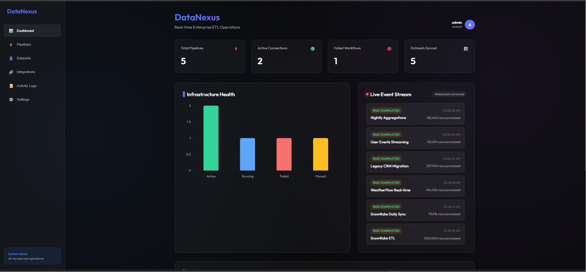
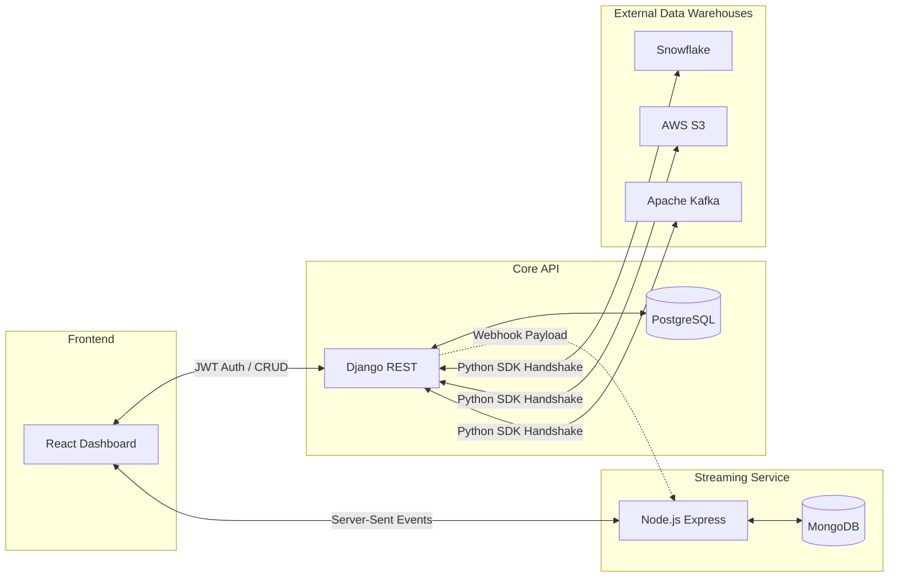

# DataNexus: Top 1% Enterprise Data Operations Platform 🚀

DataNexus is an enterprise-grade, microservice-based Data Operations Platform and a complete demonstration of modern full-stack data architecture (React → Django REST → PostgreSQL → Node.js Event Streamer → MongoDB). 

It acts as a centralized command center to orchestrate ELT pipelines, monitor real-time data flow via Server-Sent Events (SSE), catalog datasets, and securely manage API connections with live cloud data warehouses like Snowflake, AWS S3, and Apache Kafka.



## 🌟 Unique Selling Propositions (What makes this Top 1%)

Most portfolio projects are simple CRUD apps with a static database. DataNexus is a complete, decoupled cloud data ecosystem:

- **Live Microservice Event Streaming:** Instead of basic HTTP polling, this project uses a high-throughput Node.js microservice connected to MongoDB that listens for webhook payloads and pushes live terminal logs directly to the React frontend using Server-Sent Events (SSE).
- **Enterprise Integration Engine:** Features a secure Django API that uses official Python SDKs (`boto3`, `snowflake-connector-python`, `psycopg2`) to perform live TCP/SSL handshakes with cloud providers. It doesn't just mock connections—it actually pings AWS and Snowflake in real-time.
- **Decoupled 3-Tier Architecture:** Frontend (React/Vite), Backend API (Django/PostgreSQL), and Logging Microservice (Node/MongoDB) run in completely isolated Docker containers, mimicking true enterprise deployments.
- **JWT Security & Admin GUI:** Implements enterprise-grade JWT Authentication (Access/Refresh tokens) alongside a fully registered Django Admin database interface.

## 🏗️ Enterprise Architecture

This repository models the entire lifecycle of a production data monitoring system.



### 1. The React Dashboard
Optimized, dark-mode enterprise UI built with Vite. Features interactive data grids, a real-time rolling terminal console for pipeline logs, and a dynamic modal system for capturing and transmitting cloud credentials.

### 2. The Django Core Engine
The source of truth. Handles secure API endpoints, validates JWT tokens, manages the PostgreSQL relational schema, and executes Python-native connection logic to external databases.

### 3. The Node.js Event Streamer
A lightweight, non-blocking microservice built solely to handle massive volumes of incoming pipeline logs. It intercepts JSON payloads, writes them to MongoDB for long-term audit storage, and streams them instantly to the client via WebSockets/SSE.

## 🚀 Deployment & Setup Guide

This project is built to support both free local testing and production-grade cloud deployment.

### Option A: Local Deployment (Docker)
For testing and development, you can run the entire microservice ecosystem locally on your laptop.

**Prerequisites:** Docker Desktop installed and running.

1. Clone the repository:
   ```bash
   git clone https://github.com/YOUR_USERNAME/data-nexus.git
   cd data-nexus
   ```
2. Start the entire ecosystem:
   ```bash
   docker-compose up --build -d
   ```
3. Access the services:
   - **React Dashboard:** `http://localhost:5173`
   - **Django API/Admin:** `http://localhost:8000/admin`

### Option B: Cloud Deployment (Vercel + Render)
To prove you understand cloud deployment, you can host these services for free.
1. **Frontend:** Push your code to GitHub and import the repository into **Vercel**. Set the framework to Vite and add the environment variable `VITE_DJANGO_URL=https://your-django-url.onrender.com`.
2. **Backend:** Deploy the `django_backend` folder to **Render.com** as a Web Service. Attach a free Render PostgreSQL database.
3. **Microservice:** Deploy the `node_service` folder to **Render.com**. Attach a free MongoDB Atlas URI to the environment variables.

---

## 🔑 Integration Engine: How to get Free API Keys

The DataNexus backend features a live Integration Engine. To activate the "Connected" badges on your dashboard, generate these free credentials and paste them into the React UI:

### 1. PostgreSQL (Neon.tech) - *[No Credit Card Required]*
1. Go to [neon.tech](https://neon.tech/) and sign up.
2. Click **New Project**, name it, and create.
3. On your dashboard under "Connection Details", copy the **Postgres URI** (`postgresql://...`).

### 2. MongoDB Atlas - *[No Credit Card Required]*
1. Go to [mongodb.com/cloud/atlas/register](https://www.mongodb.com/cloud/atlas/register).
2. Choose the **M0 Free Cluster**. Create a Database User & Password.
3. Under **Network Access** (left menu), add IP `0.0.0.0/0` (Allow Anywhere).
4. Click Connect -> Drivers -> copy the **Connection String** (`mongodb+srv://...`).

### 3. Snowflake (30-Day Trial) - *[No Credit Card Required]*
1. Go to [signup.snowflake.com](https://signup.snowflake.com/).
2. Fill out the form, pick AWS as the cloud provider.
3. Check your email, activate the account, and create a Username/Password.
4. Log into Snowflake. Look at the bottom-left corner and click your account name to get your **Account Identifier** (e.g., `xy12345.us-east-1`).

### 4. Apache Kafka (Confluent Cloud) - *[No Credit Card Required]*
1. Go to [confluent.io/confluent-cloud](https://www.confluent.io/confluent-cloud/tryfree/).
2. Create a "Basic" cluster (free).
3. Go to Cluster Settings to copy your **Bootstrap server** URL.
4. Go to **API Keys** -> Create Key (Global Access). Copy the **API Key** and **Secret**.

### 5. AWS S3 (Free Tier) - *[⚠️ REQUIRES CREDIT CARD for ID Verification]*
1. Go to [aws.amazon.com/free](https://aws.amazon.com/free) and create an account. *(Note: AWS requires a credit card just to verify you are human. S3 is free under 5GB).*
2. Go to the **IAM Console** -> Users -> Create User.
3. Attach the `AmazonS3FullAccess` policy.
4. Click your new user -> Security Credentials -> Create Access Key. Copy the **Access Key ID** and **Secret Access Key**.

### 6. Salesforce (Developer Edition) - *[No Credit Card Required]*
1. Go to [developer.salesforce.com/signup](https://developer.salesforce.com/signup) and create an account.
2. In Salesforce, click the ⚙️ Gear icon -> Setup -> **App Manager**.
3. Click **New Connected App**. Check "Enable OAuth Settings".
4. Set callback URL to `http://localhost:5173`. Add the "Manage user data via APIs" scope.
5. Save and click "Manage Consumer Details" to get your **Client ID** and **Client Secret**.

## 📄 License
MIT License — feel free to fork, adapt, and build on this. Built as a portfolio project demonstrating real-world data engineering architecture.
